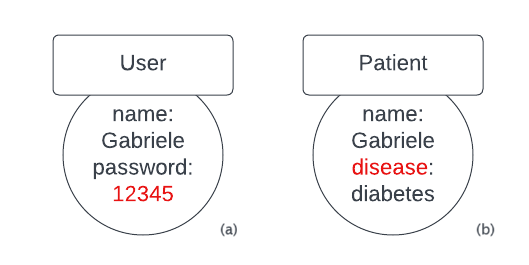
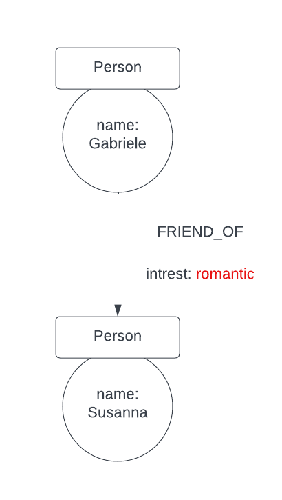
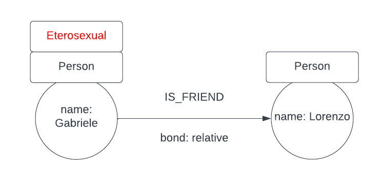
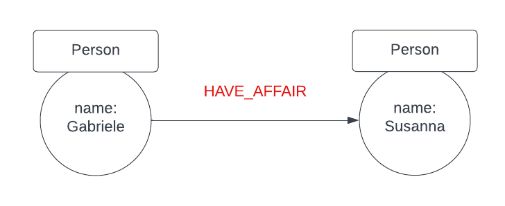
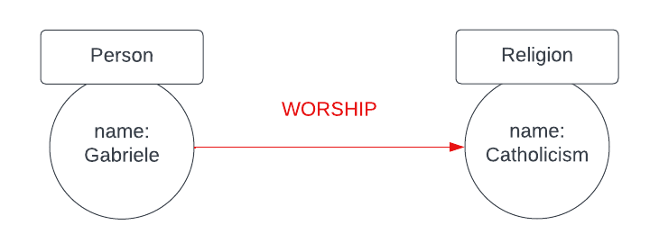
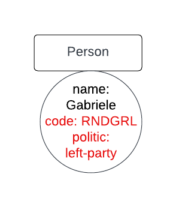
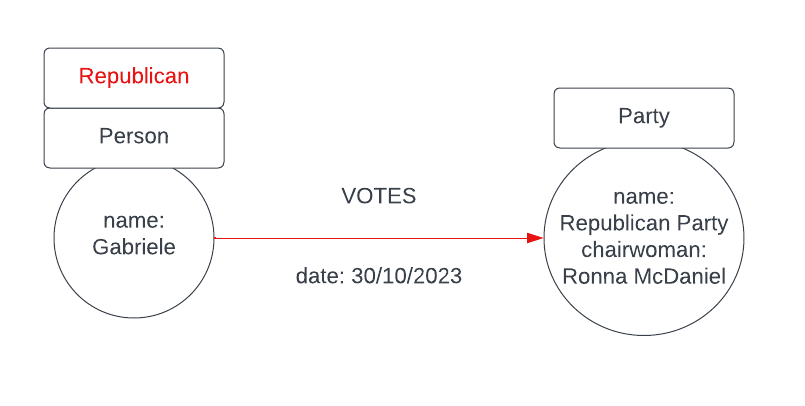

# Formalizzazione di dati sensibili in un file JSON
Descrizione formale di dati sensibili in un **Label Property Graph** utilizzando il formato file `JSON`.
La motivazione per cui utilizzo un file di questa estensione è che questo tipo di file è molto utilizzato per scambiare informazioni tra computer ed è noto per la facilità di lettura da parte dell'essere umano.

Sopra la sintassi di un file json, definisco un insieme di regole per descrivere i dati sensibili in un'istanza di dati.

## Sintassi per esprimere un dato sensibile
Ogni file json rappresenta tutti i dati sensibili per una particolare istanza di dati.
In questi primi esempi suppongo che solo una particolare proprietà, etichetta o arco possa rappresentare un'informazione sensibile in un LPG.

Ogni dato sensibile è espresso come valore di un nome `sensitive-data`.
In questi primi esempi il valore di `sensitive-data` è un solo oggetto ma in casi più complicati il valore di `sensitive-data` sarà un array di oggetti.

Analizzo ora i vari casi in cui ho un solo dato sensibile per ogni istanza dei dati e descrivo i valori per i nomi utilizzati.

### Proprietà
Per convenzione l'informazione sensibile di un'istanza, rappresentata con un'immgaine, è espressa in rosso.



```json
{
    "sensitive-data": {
        "element": "property",
        "description": {
            "linked-to": {
                "label": "User",
                "object": "node"
            },
            "list": false,
            "key": "password",
            "value": "12345",
            "type": "value"
        }
    }
}
```

Il nome `element` ha come possibili valori le stringhe *property*, *label* e *relationship* e descrive a quale elemento di un LPG è associato un dato sensibile.

Il valore del nome `description` è un oggetto che fornisce una descrizione dell'elemento con lo scopo di identificarlo univocamente.
La struttura di tale oggetto cambia a seconda del tipo di elemento ovvero una proprietà, un'etichetta, ecc.

Dal momento che la proprietà può essere associata ad un nodo oppure ad un arco, lo scopo del valore del nome `linked-to` è quello di distinguere i due casi.
Il valore di tale oggetto cambia a seconda che il dato sensibile sia associato ad un nodo o ad una relazione.

Il valore del nome `object` può essere *node* o *relationship*.
Il valore del nome `label` specifica l'etichetta dell'elemento a cui la proprietà è associata che sia nodo o relazione.

I nomi `key` e `value` rappresentano la chiave e il valore della proprietà sensibile.
Il valore del nome `list` specifica se il valore della proprietà è una lista di valori o meno. 
Inoltre il nome `type` specifica se il dato sensibile della proprietà è la sua chiave o il suo valore.



Se la proprietà è associata ad una relazione, il valore del nome  `linked-to` contiene i nomi `start` e `end` che descrivono il nodo di partenza e il nodo di arrivo della relazione stessa.

```json
{
    "sensitive-data": {
        "element": "property",
        "description": {
            "linked-to": {
                "label": "FRIEND_OF",
                "object": "relationship",
                "start": {
                    "label": "Person",
                    "object": "node"
                },
                "end": {
                    "label": "Person",
                    "object": "node"
                }
            },
            "list": false,
            "key": "interest",
            "value": "romantic",
            "type": "value"
        }
    }
}
```

### Etichetta



```json
{
	"sensitive-data": {
		"element": "label",
		"description": {
			"label": "Eterosexual",
			"linked-to": {
				"labels": [
					"Eterosexual",
					"Person"
				],
				"object": "node",
				"multiple-labels": true
			}
		}
	}
}
```

Come già accennato per le proprietà, lo scopo di molte coppie nome-valore rimane lo stesso.
Dal momento che il valore di `element` è *label* la struttura del valore del nome `description` cambia.

Il valore `label` rappresenta l'etichetta sensibile associata ad un nodo o ad un arco, per questo motivo è necessario distinguere i due casi. 

Se l'etichetta è associata ad un nodo, come nella figura precedente, allora il valore del nome `object` è *node*.
Poiché ad un nodo è possibile avere associato più di un'etichetta il valore del nome `multiple-labels` specifica se al nodo ha più di un'etichetta.
Per identificare correttamente il nodo, a cui l'etichetta è associata, il nome `labels` contiene tutte le etichette del nodo ed è presente solo se è assegnato a *true* il valore di `multiple-labels`.

Altrimenti, se l'etichetta è associata ad in arco il valore del nome `object` è *relationship*.
In questo caso è necessario specificare nei valori dei nomi `start` e `end` la descrizione del nodo di partenza e di arrivo.
Inoltre è possibile omettere il nome `multiple-labels` perché ad un arco può essere associata una e una sola etichetta.



```json
{
    "sensitive-data": {
        "element": "label",
        "description": {
            "label": "HAVE_AFFAIR",
            "object": "relationship",
            "start": {
                "label": "Person",
                "object": "node"
            },
            "end": {
                "label": "Person",
                "object": "node"
            }
        }
    }
}
```

### Relazione o arco



```json
{
    "sensitive-data": {
        "element": "relationship",
        "description": {
            "label": "WORSHIP",
            "start": {
                "label": "Person",
                "object": "node"
            },
            "end": {
                "label": "Religion",
                "object": "node"
            }
        }
    }
}
```

La sintassi per esprimere un arco sensibile è simile a quella utilizzata per rappresentare un etichetta associata ad un arco ma con alcune differenze.

Il valore del nome `element` è *relationship*.
In questo caso è l'arco in sé che rappresenta un dato sensibile ma per identificarlo è bene specificare l'etichetta associata all'arco sensibile utilizzando il valore del nome `label` e le informazioni relative al nodo di partenza e a quello di arrivo.

## Sintassi per esprimere un insieme di dati sensibili
Decido di formalizzare una insieme di dati sensibili come un array di singoli dati sensibili utilizzando le regole descritte precedentemente.
Scelgo questo approccio perché il file json rappresenta tutti i dati sensibili per un'istanza particolare di dati.



```json
{
    "sensitive-data": [
        {
            "element": "property",
            "description": {
                "linked-to": {
                    "label": "Person",
                    "object": "node"
                },
                "list": false,
                "key": "code",
                "value": "RNDGRL",
                "type": "value"
            }
        },
        {
            "element": "property",
            "description": {
                "linked-to": {
                    "label": "Person",
                    "object": "node"
                },
                "list": false,
                "key": "politics",
                "value": "left-party",
                "type": "key"
            }
        }
    ]
}
```



```json
{
    "sensitive-data": [
        {
            "element": "label",
            "description": {
                "label": "Repuplican",
                "linked-to": {
                    "multiple-labels": true,
                    "object": "node"
                }
            }
        },
        {
            "element": "relationship",
            "description": {
                "start": {
                    "label": [
                        "Person",
                        "Repuplican"
                    ],
                    "object": "node"
                },
                "end": {
                    "label": "Party",
                    "object": "node"
                }
            }
        }
    ]
}
```

# Query di creazione cypher delle istanze
Nella cartella *instace* sono presenti tutte le query chyper per creare le istanze dei dati che sono rappresentate in figura della cartella *img*.
Quelle presenti nella cartella sono delle istanze semplici per individuare alcune modalità di sanificazione dell'istanza dei dati.

# Sanificazione di un LPG

## Sanificazione di istanze dati LPG con un solo dato sensibile
In questi primi esempi prendo in considerazioni istanze in cui è presente un solo dato sensibile.

Le modalità di sanificazione dipendono dall'istanza dei dati e dall dato sensibile, in questo caso espresso tramite il file json.
Per facilitare la lettura utilizzo la rappresentazione grafica dell'istanza tramite immagine, la query cypher che popola l'istanza dei dati si trova nella cartella *instance*.

Analizzo ora i casi più semplici di sanificazione evidenziando le query che realizzano tali tecniche.

### Istanza dati 1a
Data l'istanza dei dati *1a* e il dato sensibile espresso tramite file json le possibili modalità di sanificazione sono:

- cancellazione della proprietà il cui valore è un dato sensibile,
- cancellazione del nodo che contiene la proprietà il cui valore è un dato sensibile.

#### Cancellazione di una proprietà associata ad un nodo
Per cancellare una proprietà associata ad un nodo si utilizza la clausola `REMOVE`.

```
MATCH (u:User)
WHERE u.password = "12345"
REMOVE u.password
```

Si nota che in Neo4j:
 
- non è possibile avere una proprietà con valore `null`,
- la clausola `REMOVE` permette di rimuove anche etichette. Se si tenta di rimuovere un'etichette da un nodo senza etichetta si ottiene un messaggio di errore.

#### Cancellazione di un nodo
Per cancellare un nodo che non ha alcuna relazione entrante o uscente da esso si utilizza la clausola `DELETE`.

```
MATCH (u:User)
WHERE u.password = "12345"
DELETE u
```

Per cancellare un nodo e tutte le relazione a cui è collegato, sia in entrata che in uscita, si utilizza la clausola `DETACH DELETE`.

```
MATCH (u:User)
WHERE u.password = "12345"
DETACH DELETE u
```

### Istanza dei dati 1b
Data l'istanza dei dati *1b* e il corrispettivo dato sensibile espresso tramite file json, il grafo può essere sanificato in diversi modi:

- cancellando la proprietà la cui chiave è una dato sensibile,
- cancellando il nodo a cui la proprietà con chiave sensibile è associata.

Elenco ma non descerivo le query, che realizzano la sanificazione dell'istanza dei dati, perché simili concettualmente alle precedenti.

```
MATCH (p:Patient)
WHERE p.disease = "diabetes"
REMOVE d.disease
```

```
MATCH (p:Patient)
WHERE p.disease = "diabetes"
DETACH DELETE p
```

### Istanza dei dati 2
Data l'istanza dei dati *2* e il corrispettivo dato sensibile espresso tramite file json, il grafo può essere sanificato in diversi modi:

- cancellazione del valore sensibile dalla lista di valori della proprietà,
- cancellazione della proprietà che contiene il valore sensibile,
- cancellazione del nodo a cui è associata la proprietà sensibile.

Le query che realizzano la cancellazione di una proprietà e quella di un nodo sono già state descritte in precedenza, quindi le riporto senza commentarle.

```
MATCH (u:User)
WHERE "politics" IN u.hobbies
REMOVE u.hobbies
```

```
MATCH (u:User)
WHERE "politics" IN u.hobbies
DELETE u
```

#### Cancellazione di un valore da una lista di una proprietà associata ad un nodo
Per modificare la proprietà sensibile si utilizza la clausola `SET`.
Inoltre per modificare la lista, contentente il valore sensibile, si utilizza il list comprehension, dal momento che Neo4j supporta nativamente diversi tipi di dati.

```
MATCH (u:User)
WHERE "politics" IN u.hobbies
SET u.hobbies = [x IN u.hobbies WHERE x <> "politics"]
```

### Istanza dei dati 3
Data l'istanza dei dati *3* e il corrispettivo dato sensibile espresso tramite un file json, il grafo può essere sanificato:

- cancellando la proprietà sensibile associata alla relazione,
- cancellando la relazione a cui è associata la proprietà sensibile.

#### Cancellazione di una proprietà associata ad una relazione
Per cancellare una proprietà associata ad una relazione si utilizza la clausola `REMOVE`.
Questo modo di procedere è analogo a quanto visto per la rimozione di una proprietà associata ad un nodo.

```
MATCH (:Person) -[r:FRIEND_OF]->(:Person)
REMOVE r.interest
```

#### Cancellazione di una relazione
Per cancellare una relazione si utilizza la clausola `DETACH DELETE` specificando il riferimento alla relazione da rimuovere.

```
MATCH (:Person) -[r:FRIEND_OF]->(:Person)
DETACH DELETE r
```

### Istanza dei dati 4
Data l'istanza dei dati *4* e il corrispettivo dato sensibile espresso tramite un file json, il grafo può essere sanificato in vari modi:

- cancellando il valore sensibile della proprietà associata alla relazione, dal momento che la proprietà ha come valore una lista,
- cancellando la proprietà sensibile associata alla relazione,
- cancellando la relazione a cui è associata la proprietà sensibile.

Le ultime due modalità di sanificazione sono già state tratte nel caso precedente, per questo motivo riporto soltanto le query senza commentarle.

```
MATCH (:Person)-[r:FRIEND_OF]->(:Person)
WHERE "politics" IN r.bond
REMOVE r.
```

```
MATCH (:Person)-[r:FRIEND_OF]->(:Person)
WHERE "politics" IN r.bond
DETACH DELETE r
```

#### Cancellazione di un valore da una lista di una proprietà associata ad una relazione
In modo analogo a quanto fatto quando il valore di una lista è associato ad un nodo, si utilizza la clausola `SET` per modificare la proprietà associata alla relazione e per rimuovere il valore sensibile dalla lista si utilizza una list comprehnsion.

```
MATCH (:Person)-[r:FRIEND_OF]->(:Person)
WHERE "politics" IN r.bond
SET r.bond = [x IN r.bond WHERE x <> "politics"]
```

### Istanza dei dati 7
Data l'istanza dei dati *7* e il corrispettivo dato sensibile espresso tramite un file json, il grafo può essere sanificato:

- eliminando l'etichetta sensibile dal nodo,
- cancellando il nodo a cui è associata l'etichetta sensibile.

Le modalità per cancellare un nodo sono già state tratte in precedenza quindi riporto solo la query che realizza questa modalità di sanificazione.

```
MATCH (x:Person:Eterosexual)
DETACH DELETE x
```

#### Cancellazione di un etichetta da un nodo
Dal momento che è possibile avere un nodo senza etichette, in generale, si può rimuovere un'etichetta da un nodo se questo ha associato almeno un'etichetta.
Per cancellare un etichetta da un nodo si utilizza la clausola `REMOVE`.

```
MATCH (x:Person:Eterosexual)
REMOVE x:Eterosexual
```

### Istanza dei dati 8
Data l'istanza dei dati *8* e il corrispettivo dato sensibile espresso tramite un file json, il grafo può essere sanificato:

- cancellando la relazione a cui è associata l'etichetta sensibile,
- cancellando il nodo di partenza o di arrivo della relazione a cui è associata l'etichetta sensibile.

Entrambe le modalità di sanificazione sono già state trattate in precedenza, per questo motivo riporto soltanto le query che realizzano le strategie di sanificazione senza commentarle.

```
MATCH (:Person)-[r:HAVE_AFFAIR]->(:Person)
DETACH DELETE r
```

```
MATCH (x:Person)-[:HAVE_AFFAIR]->(y:Person)
DETACH DELETE x
```

```
MATCH (x:Person)-[:HAVE_AFFAIR]->(y:Person)
DETACH DELETE y
```

### Istanza dei dati 9
Data l'istanza dei dati *9* e il corrispettivo dato sensibile espresso tramite un file json, il grafo può essere sanificato:

- cancellando la relazione sensibile tra i due nodi.

Questa modalità di sanificazione è già stata trattata in precedenza, quindi riporto la query che realizza questa modalità di sanificazione del grafo senza commentarla.

```
MATCH (:Person)-[w:WORSHIP]->(:Religion)
DETACH DELETE w
```

## Sanificazione di istanze dati LPG con più di un dato sensibile
Nei prossimi esempi ci sono più dati sensibili nella stessa istanza. 
Infatti, come si può notare nella formalizzazione del dato sensibile, il valore del nome `sensitive-data` è un array di oggetti.
Quindi per sanificare l'istanza dei dati è necessario che ogni singolo elemento sensibile non sia presente nell'istanza dei dati dopo la sanificazione.

### Istanza dei dati 12
Data l'istanza dei dati *12* e il corrispettivo dato sensibile espresso tramite un file json, il grafo può essere sanificato:

- cancellando ogni proprietà sensibile associata al nodo,
- cancellando il nodo che contiene una proprietà sensibile.

#### Cancellazione di ogni proprietà sensibile da un nodo
Come già detto in precedenza per cancellare una proprietà da un nodo si utilizza la clausola `REMOVE`.

```
MATCH(p:Person)
WHERE p.code = "RNDGRL" AND p.politics = "left-party"
REMOVE p.code, p.politics
```

#### Cancellazione del nodo a cui sono associate proprietà sensibili
Per cancellare un nodo si utilizza la clausola `DETACH DELETE` dopo aver identificato correttamente il nodo con i dati sensibili.

```
MATCH(p:Person)
WHERE p.code = "RNDGRL" AND p.politics = "left-party"
DETACH DELETE p
```

### Istanza dei dati 14
Data l'istanza dei dati *14* e il corrispettivo dato sensibile espresso tramite un file json, il grafo può essere sanificato:

- cancellando il nodo di partenza della relazione perché ha un'etichetta sensibile e perché da esso parte un relazione sensibile,
- cancellando l'etichetta sensibile e la relazione sensibile tra i due nodi.

#### Cancellazione del nodo di partenza e della relazione ad esso collegata
Osservando che il nodo *p* contiene sia l'etichetta sensibile e che *p* è anche il punto di partenza della relazione, cancellando il nodo, utilizzando la clausola `DETACH DELETE`, si ottiene una versione sanificata del grafo perché questo cancella il nodo e ogni relazione da esso entrante o uscente.

```
MATCH (p:Person)-[:VOTES]->(:Party)
DETACH DELETE p
```

#### Cancellazione del etichetta e della relazione tra i due nodi
Come già trattato in precedenza si ricorda che la clausola `REMOVE` permette di rimuovere un'etichetta da un nodo e si utilizza la clausola `DETACH DELETE` che permette di cancellare una relazione.

```
MATCH (p:Person)-[r:VOTES]->(:Party)
REMOVE p:Republican
DETACH DELETE r
```